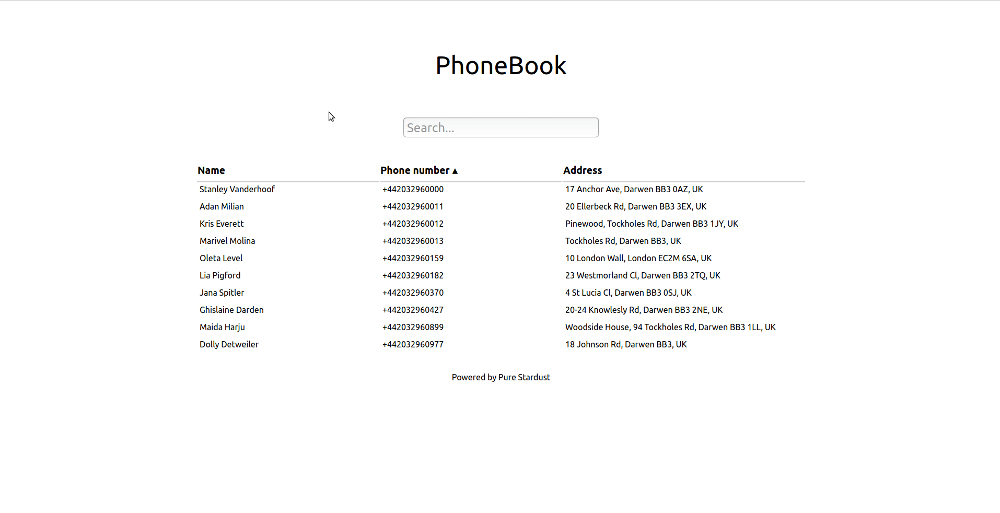

# PhoneBook

Simple WebApp built using ReactJS

- displays the phone numbers after fetching it from the URL
- filtering
- sorting (asc, desc, none)



## Run Locally

Execute the following command in terminal

```bash
npm start
```

And, it will open up the site on your default browser.

## Run online

Or, you can run it online from [here](https://codesandbox.io/s/github/sam016/phonebook-beg-ui)

> **NOTE:** codesandbox seems to have some sandbox issues due to which it cannot access the API
